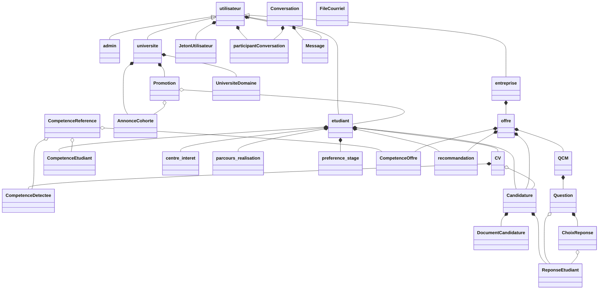
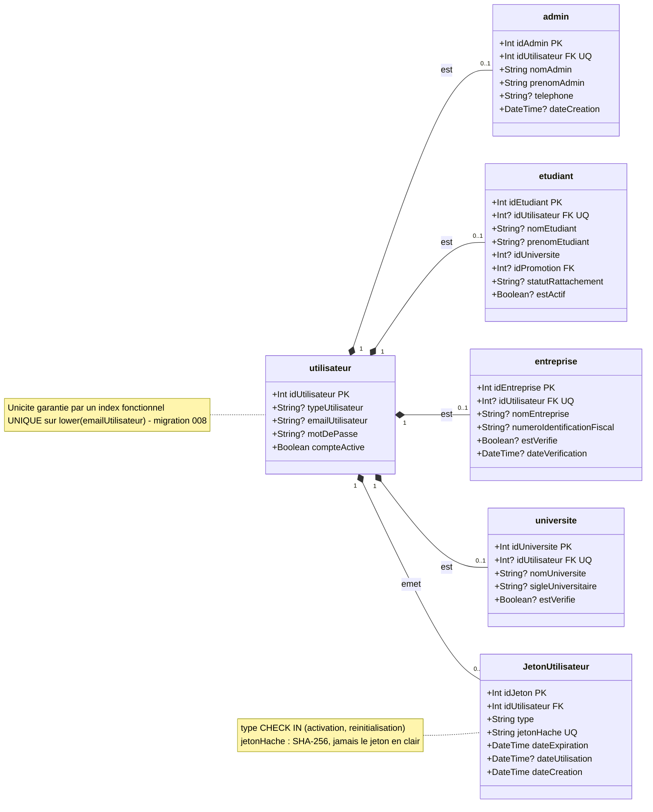
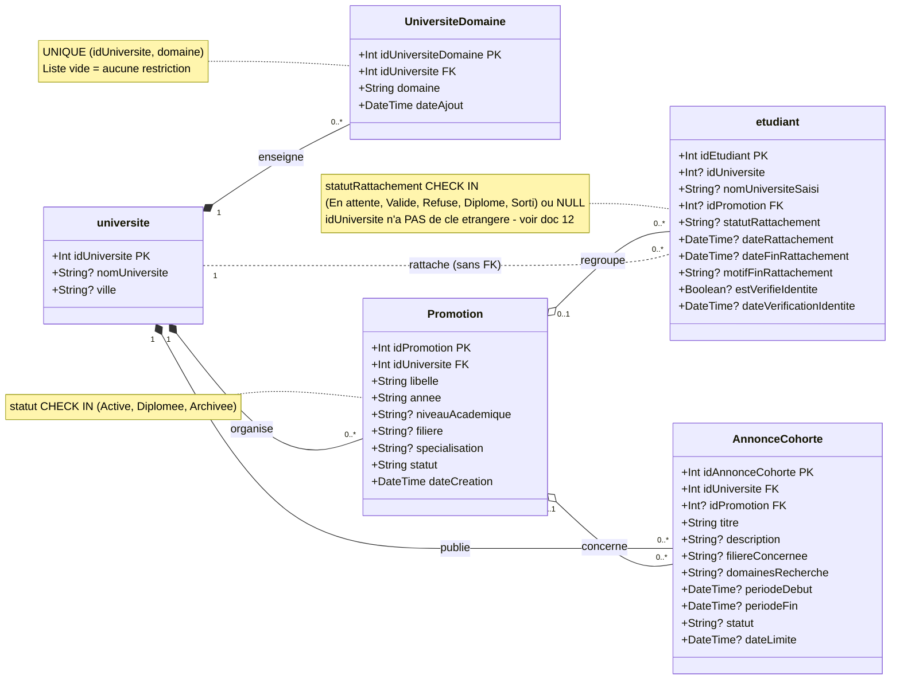
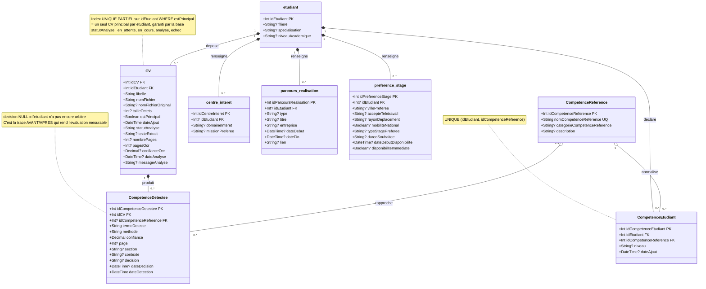
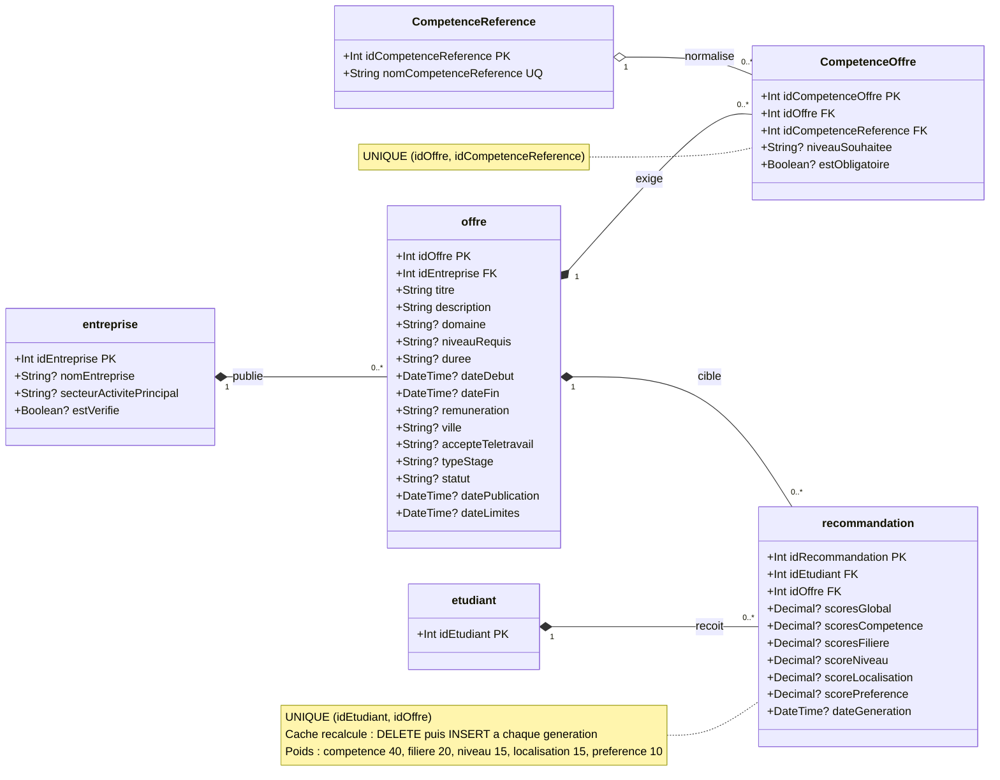
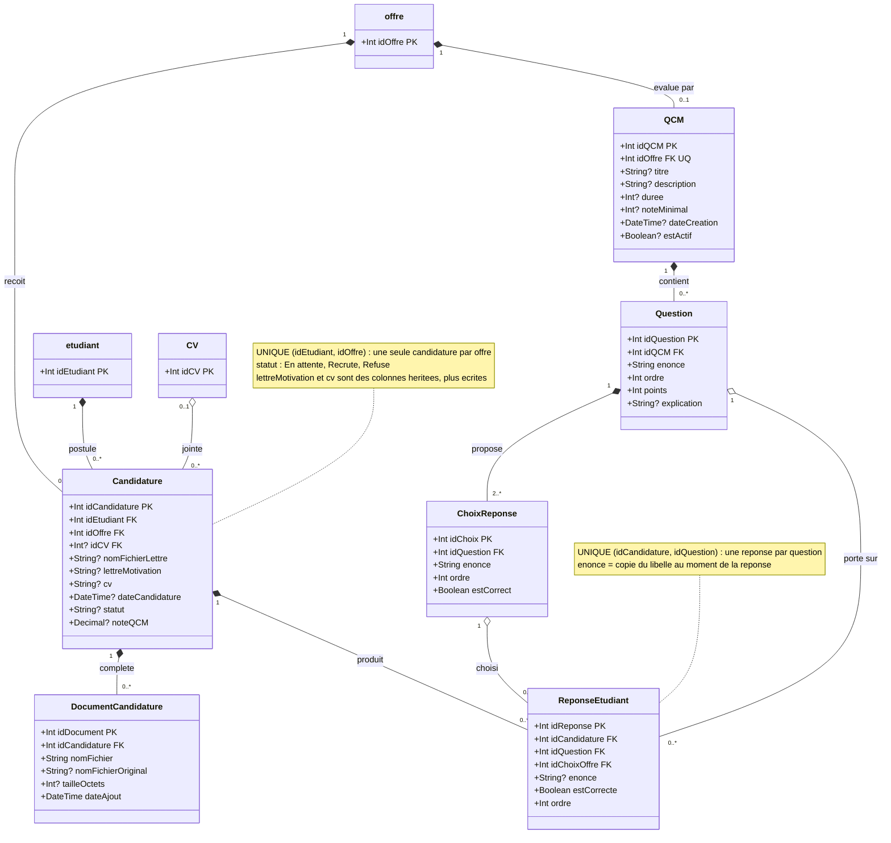
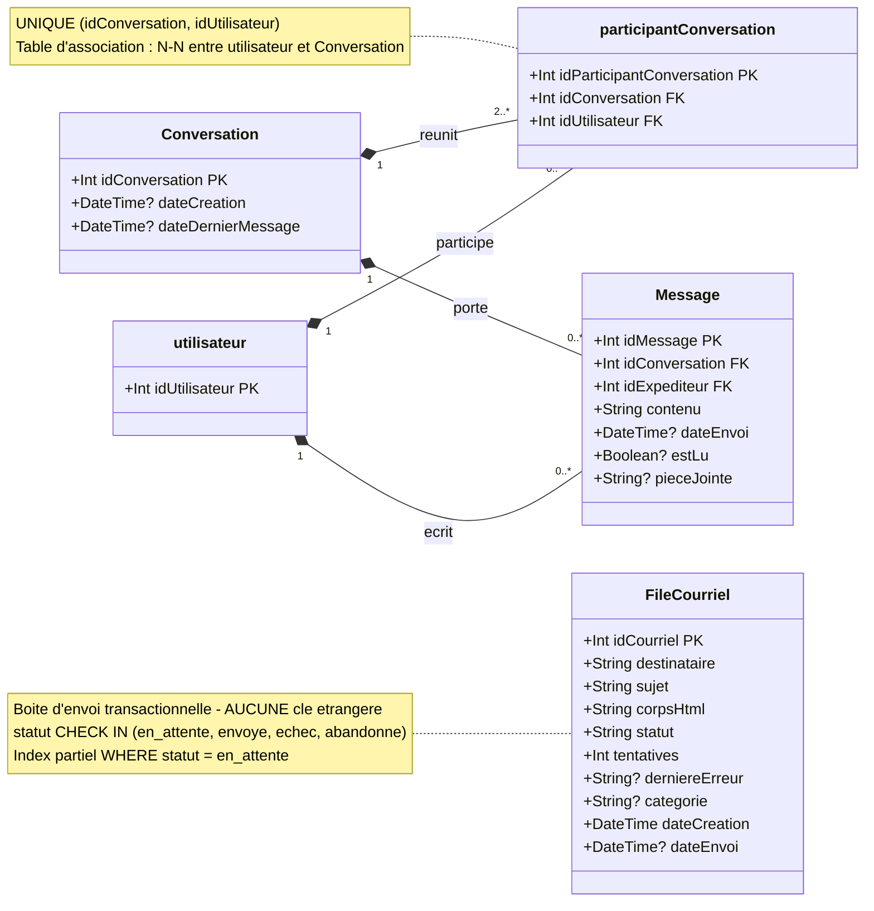

# Diagramme de classes — Stage Share

Source de vérité : `prisma/schema.prisma` (28 entités, PostgreSQL).
Le commentaire de chaque liaison est développé dans `12 - MODELE-DE-DONNEES.md`.

---

## Conventions de lecture

| Notation             | Signification                                                                     |
| -------------------- | --------------------------------------------------------------------------------- |
| `PK`               | clé primaire                                                                     |
| `FK`               | clé étrangère                                                                  |
| `UQ`               | contrainte d'unicité                                                             |
| `?` après le type | colonne dont le **NULL est autorisé**                                                   |
| `*--`              | composition — l'enfant n'existe pas sans le parent (`ON DELETE CASCADE`)       |
| `o--`              | agrégation — l'enfant survit conceptuellement, mais la base cascade quand même |
| `-->`              | référence simple                                                                |
| `<\|--`              | spécialisation *conceptuelle* — en base, c'est une table par rôle reliée à `utilisateur` par une FK unique (voir §1) |

Les noms sont donnés **exactement** tels qu'ils existent en base : les entités
historiques sont en minuscules (`etudiant`, `offre`, `universite`), celles ajoutées
par les migrations du Lot 3 et suivants sont en PascalCase (`CV`, `Promotion`,
`JetonUtilisateur`). Cette différence de casse n'est pas cosmétique : elle marque
deux générations du schéma qui n'ont pas les mêmes exigences de nullabilité.

---

## 0. Vue d'ensemble

`FileCourriel` n'apparaît reliée à rien : c'est volontaire, voir §6.

---

## 1. Comptes et identités

Un seul point d'authentification, quatre rôles portés par quatre tables distinctes.

---

## 2. Université, promotions, rattachement

---

## 3. Profil étudiant, CV et compétences

C'est le cœur du mémoire : la chaîne `CV → texte → compétences détectées → arbitrage → profil`.

---

## 4. Entreprise, offres, appariement

---

## 5. Candidature, dossier et QCM

---

## 6. Messagerie et courriels sortants

---

## Récapitulatif des cardinalités

| Relation                                                                                                      | Cardinalité                       | Suppression du parent |
| ------------------------------------------------------------------------------------------------------------- | ---------------------------------- | --------------------- |
| `utilisateur` → `admin` / `etudiant` / `entreprise` / `universite`                                 | 1 → 0..1                          | CASCADE               |
| `utilisateur` → `JetonUtilisateur`                                                                       | 1 → 0..*                          | CASCADE               |
| `universite` → `Promotion` / `UniversiteDomaine` / `AnnonceCohorte`                                  | 1 → 0..*                          | CASCADE               |
| `Promotion` → `etudiant`                                                                                 | 0..1 → 0..*                       | SET NULL              |
| `Promotion` → `AnnonceCohorte`                                                                           | 0..1 → 0..*                       | SET NULL              |
| `etudiant` → `CV`                                                                                        | 1 → 0..* (1 seul principal)       | CASCADE               |
| `etudiant` → `CompetenceEtudiant` / `centre_interet` / `parcours_realisation` / `preference_stage` | 1 → 0..*                          | CASCADE               |
| `CV` → `CompetenceDetectee`                                                                              | 1 → 0..*                          | CASCADE               |
| `CompetenceReference` → `CompetenceDetectee`                                                             | 0..1 → 0..*                       | CASCADE               |
| `CompetenceReference` → `CompetenceEtudiant` / `CompetenceOffre`                                       | 1 → 0..*                          | CASCADE               |
| `entreprise` → `offre`                                                                                   | 1 → 0..*                          | CASCADE               |
| `offre` → `CompetenceOffre`                                                                              | 1 → 0..*                          | CASCADE               |
| `offre` → `QCM`                                                                                          | 1 → 0..1                          | CASCADE               |
| `QCM` → `Question` → `ChoixReponse`                                                                   | 1 → 0..*                          | CASCADE               |
| `etudiant` / `offre` → `Candidature`                                                                   | 1 → 0..* (couple unique)          | CASCADE               |
| `CV` → `Candidature`                                                                                     | 0..1 → 0..*                       | SET NULL              |
| `Candidature` → `DocumentCandidature` / `ReponseEtudiant`                                              | 1 → 0..*                          | CASCADE               |
| `etudiant` / `offre` → `recommandation`                                                                | 1 → 0..* (couple unique)          | CASCADE               |
| `Conversation` ↔ `utilisateur`                                                                           | N-N (table `participantConversation`) | CASCADE               |
| `Conversation` / `utilisateur` → `Message`                                                             | 1 → 0..*                          | CASCADE               |
| `FileCourriel`                                                                                              | aucune                             | —                    |
